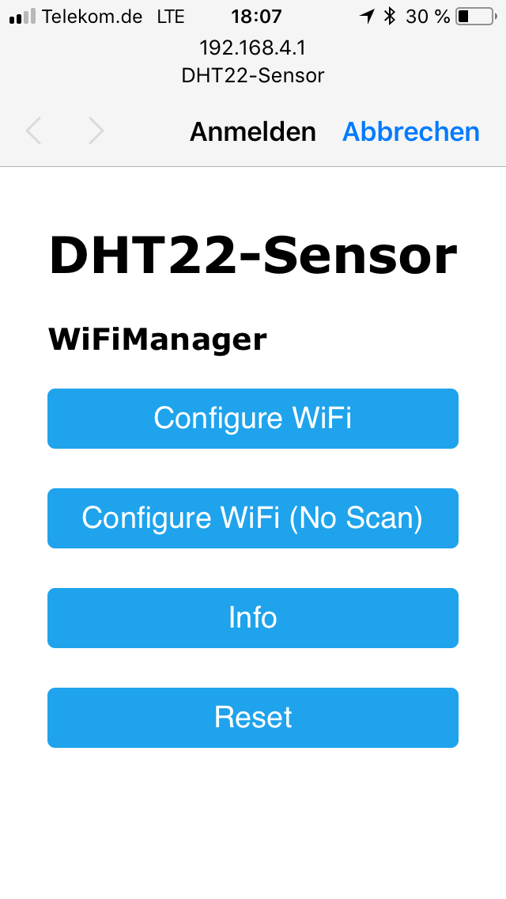
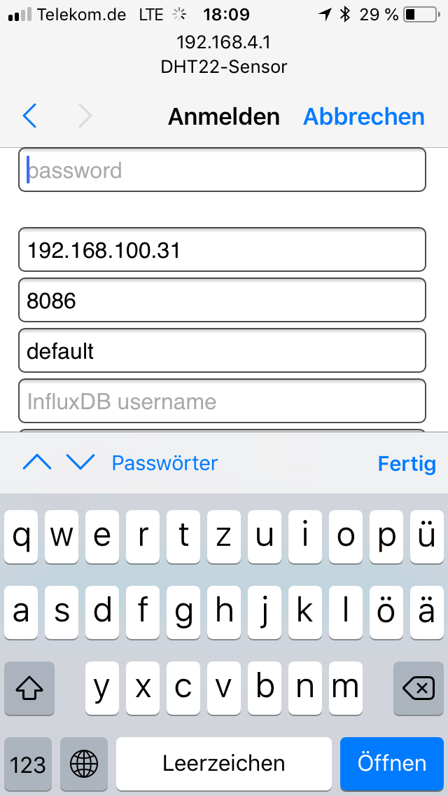

# ESP8266 and InfluxDB sketches
This is a collection of ESP8266 and DHT22 sketches I'm using in my home. 

# Dependencies
- https://github.com/esp8266/Arduino
- https://github.com/adafruit/DHT-sensor-library
- https://github.com/adafruit/Adafruit_Sensor
- https://github.com/rudelm/ESP_influxdb/tree/fix-constructor - I needed an empty default constructor for this project
- ~~https://github.com/tzapu/WiFiManager~~ - replaced with https://github.com/kentaylor/WiFiManager Replace the existing WifiManager with this code, or rename the previous code accordingly
- https://github.com/datacute/DoubleResetDetector
- https://github.com/bblanchon/ArduinoJson
- https://github.com/adafruit/Adafruit_SPIFlash
- https://github.com/esp8266/arduino-esp8266fs-plugin/releases 

If you're using Mac OS High Sierra, you'll need [working](https://www.reddit.com/r/arduino/comments/7cq68i/any_new_drivers_for_ch340g_on_mac_os_high_sierra/) USB Serial drivers for the CH340G chip.

# Pinout
I'm using an ESP8266 NodeMCU Lolin v3. The DHTPIN points to 12, which is the GPIO Pin 12 and therefore the Pin D6:

Image taken from https://github.com/opendata-stuttgart/meta/wiki/Pinouts-NodeMCU-v2,-v3

You should also be able to use the Arduino Pin Definitions directly, so this would be D6 instead of 12.

# Setup
## Configuration in code
There are a few defaults you might want to touch depending on your needs (especially the ones for the default configuration in the browser). If you choose a DHT read interval of 30s, it will complain from time to time about unreadable values. I've set it to 60s as there shouldn't be that fast changes to the measurements.

## Configuration in Browser
If you use the `ManagedWifiDhtInfluxDB` project, you'll get a new Wifi AP in your network list called `DHT22-Sensor`. You can connect to this Wifi with password `configureMe`. After entering these credentials, a Webpage will be shown to you:

This is similar to the captive portals you might know from public hotpots. Now enter all requested information:

After you've entered all necessary information, the settings will be persisted.

You can now verify your connection if you'll click on "check how it went". You yhould be able to see the configuration page but on the bottom it should show you a hint that it is connected to the Wifi and the IP of the ESP.

## Troubleshooting
If you don't complete the configuration in less than 5 minutes, the ESP will disconnect you. You need to reconnect to the Wifi for another configuration run.

Previous versions of the code used a define to wipe the configuration data. This was quite annoying since you've always need to have access to a computer and access to the sourcecode to make the configuration change. Using https://github.com/kentaylor/WiFiManager I'm able to reset the configuration once you'll hit the reset button on the ESP twice in a given amount of time (currently 10s). However, the define to wipe the configuration data is still present and can be helpful during debugging of the code. 

If you'll double press within 10s the ESPs reset button, you'll bring back the Wifi AP you'll need for reconfiguration. If you just press reset once, just the ESP restarts.

You can also check the configuration page to see your settings. If you've ever configured the ESP before, you'll see the entered values again. Only the SSID and Wifi password are empty.

If you want to change a setting, you'll need to select the SSID and need to enter the password again. If you just want to have a look, hit the back button and exit the portal.