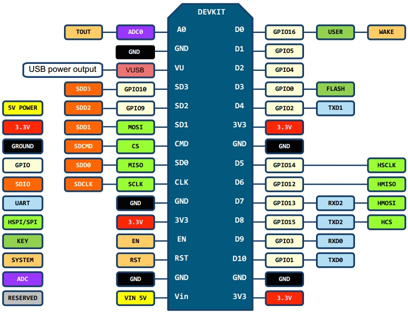

# ESP8266 and InfluxDB sketches
- ESP8266 and DHT22

# Dependencies
- https://github.com/esp8266/Arduino
- https://github.com/adafruit/DHT-sensor-library
- https://github.com/adafruit/Adafruit_Sensor
- https://github.com/hwwong/ESP_influxdb

# Pinout
I'm using an ESP8266 NodeMCU Lolin v3. The DHTPIN points to 12, which is the GPIO Pin 12 and therefore the Pin D6:

Image taken from https://github.com/opendata-stuttgart/meta/wiki/Pinouts-NodeMCU-v2,-v3

You should also be able to use the Arduino Pin Definitions directly, so this would be D6 instead of 12.