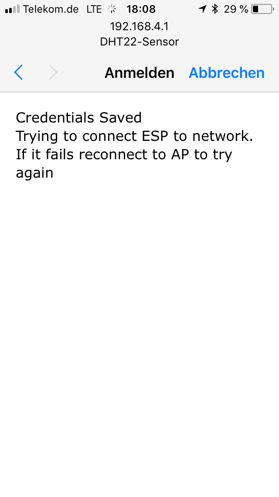

# ESP8266 and InfluxDB sketches
This is a collection of ESP8266 and DHT22 sketches I'm using in my home. While the `DHTInfluxDB` project was from the forked repo, the `ManagedWifiDhtInfluxDB` project is a new development up from the ground.

# Dependencies
- https://github.com/esp8266/Arduino
- https://github.com/adafruit/DHT-sensor-library
- https://github.com/adafruit/Adafruit_Sensor
- https://github.com/hwwong/ESP_influxdb - I'm using a custom version attached to this git repo, will fork later
- https://github.com/tzapu/WiFiManager
- https://github.com/bblanchon/ArduinoJson
- https://github.com/adafruit/Adafruit_SPIFlash

If you're using Mac OS High Sierra, you'll need [working](https://www.reddit.com/r/arduino/comments/7cq68i/any_new_drivers_for_ch340g_on_mac_os_high_sierra/) USB Serial drivers for the CH340G chip.

# Pinout
I'm using an ESP8266 NodeMCU Lolin v3. The DHTPIN points to 12, which is the GPIO Pin 12 and therefore the Pin D6:

Image taken from https://github.com/opendata-stuttgart/meta/wiki/Pinouts-NodeMCU-v2,-v3

You should also be able to use the Arduino Pin Definitions directly, so this would be D6 instead of 12.

# Setup
If you use the `ManagedWifiDhtInfluxDB` project, you'll get a new Wifi AP in your network list called `DHT22-Sensor`. You can connect to this Wifi with password `configureMe`. After entering these credentials, a Webpage will be shown to you:

This is similar to the captive portals you might know from public hotpots. Now enter all requested information:

After you've entered all necessary information, the settings will be persisted and it will connect to the new Wifi as client:

If you don't complete the configuration in less than 5 minutes, the ESP will disconnect you. You need to reconnect to the Wifi for another configuration run.

If you've ever used the ESP8266 for anything else, it might happen, that you still have a Wifi Configuration stored. In this case, comment out the wifiManager.resetSettings() method as well as the SPIFFS.format() method to clear the memory. After upload comment those methods back in and flash again.